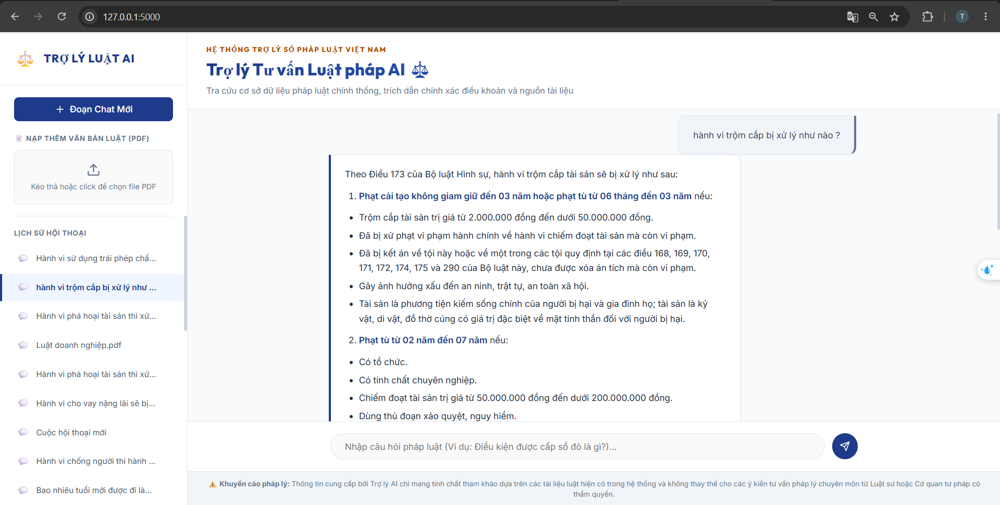

# Legal Advisory Chatbot System

## Description 

The **Legal Advisory Chatbot System** is designed to assist users by answering questions related to Vietnamese law. By leveraging advanced Retrieval-Augmented Generation (RAG) techniques, this system can analyze and retrieve relevant legal documents from an extensive collection of official Vietnamese legal texts. The core functionality of the chatbot includes providing users with accurate and up-to-date legal information, helping them understand complex legal terminology, and offering clear, actionable advice based on Vietnamese legal documents. This system is highly valuable for individuals, businesses, and legal professionals seeking quick access to legal knowledge.

## Demo


## Models & Technologies

**LLM Model for Reasoning & Answering:**
- **Llama 3.3 70B (via Groq API)**: Used for precise, high-quality, and context-aware responses based on retrieved laws.

**Embeddings & Search Models:**
- **Cohere Embedding (`embed-multilingual-v3.0`)**: 1024-dimensional multilingual model optimized for search and retrieval.
- **HuggingFace Sentence Transformer (`keepitreal/vietnamese-sbert`)**: Alternative local embedding model optimized for Vietnamese.
- **Cohere Rerank (`rerank-multilingual-v3.0`)**: Used to re-rank retrieved documents, ensuring the top results are the most relevant.

**Database & Storage:**
- **Qdrant Vector Database**: For efficient high-dimensional vector search.
- **SQL Server (MS SQL)**: For tracking chat sessions, history, and PDF upload summaries.

## Features

- **Vietnamese Law Knowledge Base**: The chatbot is built upon a large dataset of Vietnamese legal documents, ensuring that the responses are based on reliable and official sources.
- **Hybrid Search & Re-ranking**: Combines vector database retrieval with Cohere's state-of-the-art re-ranking engine to ensure high precision in retrieved laws.
- **Dynamic PDF Uploading & Indexing**: Users can upload new legal PDF documents, which are automatically indexed into Qdrant, summarized, and integrated into the conversation context.
- **Session History Management**: Full conversation history tracking stored in SQL Server, allowing users to switch between, delete, or resume previous chats.


## Data Ingestion & Processing

The core of the system relies on high-quality legal documents. The steps involved in data processing include:

1. **Document Ingestion**: Parsing PDF documents using Python-based extractors to extract raw legal text.
2. **Article-Aware Chunking**: Legal texts are intelligently split by **Điều (Article)** boundaries using regex detection, preserving the complete semantic unit of each law article. If an article is too long (> 1,500 characters), it is further split into sub-chunks while retaining the same `article` and `law_name` metadata for accurate filtering. Falls back to `RecursiveCharacterTextSplitter` (chunk size: `2000`, overlap: `300`) for non-structured documents.
3. **Rich Metadata Enrichment**: Each chunk is tagged with structured metadata: `law_name`, `article`, `chapter`, `title`, `source` — enabling precise Qdrant metadata filtering during retrieval.
4. **Vector Embeddings**: Converting text chunks into high-dimensional vector representations using Cohere or HuggingFace embeddings.
5. **Vector Storage (Qdrant)**: Storing the vectors in Qdrant collections (`vietnamese_laws`) to enable rapid semantic similarity search.

---

## 📊 Evaluation Results (RAGAS)

The RAG pipeline was evaluated using [RAGAS](https://docs.ragas.io/) on a curated set of Vietnamese law Q&A pairs.

| Metric | Score |
|---|---|
| Faithfulness | **0.88** |
| Answer Relevancy | **0.7** |
| Context Precision | **0.85** |
| Context Recall | **0.98** |

> Evaluated with Groq `llama-3.3-70b-versatile` as judge LLM, Cohere `embed-multilingual-v3.0` for embeddings.

---

## Setup & Running the Application

### 1. Prerequisites
Ensure you have the following installed:
* [Docker & Docker Compose](https://www.docker.com/)
* SQL Server instance (local or remote)

### 2. Configuration
Create a `.env` file in the root directory:
```env
GROQ_API_KEY=your_groq_api_key
COHERE_API_KEY=your_cohere_api_key
EMBEDDING_PROVIDER=cohere # 'cohere' or 'huggingface'
LLM_MODEL=llama-3.3-70b-versatile

# SQL Server Configuration
SQL_SERVER=host.docker.internal
SQL_DATABASE=Legal_Chatbot_DB
SQL_TRUSTED_CONNECTION=no
SQL_USERNAME=your_username
SQL_PASSWORD=your_password
```

### 3. Running with Docker Compose
To build and start the entire stack (FastAPI web app, mounts local directories for dynamic templates, static files, and databases):

```bash
docker compose up --build
```
The application will be accessible at: `http://localhost:5000`
